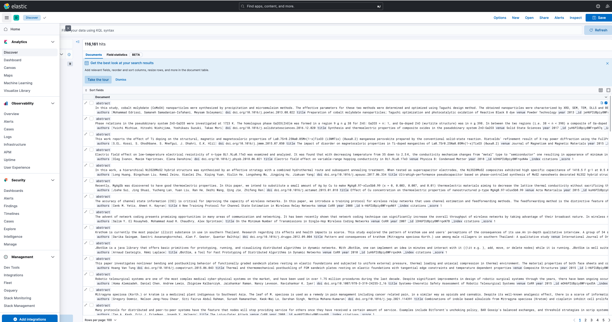

### 代码介绍

#### getdata.py

分多线程从数据库中读取数据，对数据字段进行简单的处理，存入json文件中，为创建elasticsearch的索引做数据准备。

#### build_ciations.sh

shell脚本文件，建立elasticsearch索引，索引字段包括题目、作者、摘要、doi、期刊和年份。，其中题目、作者、摘要、期刊为模糊查询，doi和年份主要为精确查询。

#### ES.py

为脚本文件建立的索引添加数据，数据为getdata.py处理之后得到的数据。

### 检索框架

#### Elasticsearch部署

- 检查系统是否安装java，没有java环境需要手动配置java

- 下载Elasticsearch服务安装包：<https://www.elastic.co/cn/downloads/elasticsearch>

- 修改配置文件如下：（使kibana可以公网访问）
  - 
  
- 进入bin文件夹，命令行运行elastichsearch.sh，启动elasticsearch服务

#### Kibana部署

- 检查系统是否安装java，没有java环境需要手动配置java
- 下载Kibana服务安装包： <https://www.elastic.co/cn/downloads/kibana>
- 修改配置文件如下：(使kibana可以公网访问)
  - 

### 部署结果

- 网页访问 <http://43.143.163.72:5601> 进入kibana页面
- 打开侧边栏选择Discover，可以看到test这个view下的结果：
  - 